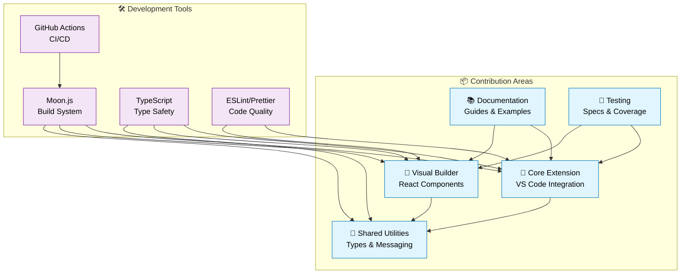

# Contributing to Tari VS Code Extension

> **🤝 Welcome! Your contributions help make blockchain development more accessible to everyone.**

We're excited to have you contribute to the Tari VS Code Extension project. This guide will help you get started with contributing code, documentation, bug reports, and feature requests.

## 🚀 Quick Start for Contributors

### Prerequisites

- **Git** (for version control)
- **proto** (automatic tool version management)
- **VS Code** (recommended IDE)

### Setup Your Development Environment

1. **Fork and clone**:
   ```bash
   git fork https://github.com/fluffypony/tari-vscode-nocode-extension.git
   git clone https://github.com/YOUR_USERNAME/tari-vscode-nocode-extension.git
   cd tari-vscode-nocode-extension
   ```

2. **Install tools and dependencies**:
   ```bash
   # Install proto for automatic tool management
   curl -fsSL https://moonrepo.dev/install/proto.sh | bash
   
   # Install correct Node.js and pnpm versions
   proto use
   
   # Install project dependencies
   pnpm install
   ```

3. **Build and test**:
   ```bash
   # Build the entire project
   moon tari-extension:build
   
   # Run tests
   pnpm test
   
   # Start local development
   cd packages/tari-extension
   code .
   ```

4. **Launch development extension**:
   - Press `F5` in VS Code
   - Select "Run Extension" configuration
   - Test your changes in the Extension Development Host

## 🏗️ Project Structure

Understanding the monorepo architecture will help you contribute effectively. See the [📊 Architecture Overview](README.md#-architecture) for the complete system design.



**Package Responsibilities:**
- **🎯 [tari-extension](packages/tari-extension/)**: VS Code extension host, custom editors, and command handling
- **🔧 [tari-extension-common](packages/tari-extension-common/)**: Type-safe message passing, configuration utilities, and shared types
- **🖥️ [tari-extension-webview](packages/tari-extension-webview/)**: Activity bar React components and JSON parsing capabilities
- **🎨 [tari-extension-query-builder](packages/tari-extension-query-builder/)**: Core visual transaction building logic and execution planning
- **📦 [tari-extension-query-builder-webview](packages/tari-extension-query-builder-webview/)**: Webview-optimized build for `.tari` file editor

## 🎯 Types of Contributions

### 🐛 Bug Reports

**Before reporting:**
1. Check [existing issues](https://github.com/fluffypony/tari-vscode-nocode-extension/issues)
2. Try the latest development version
3. Gather debugging information

**Create effective bug reports:**
- Use the [bug report template](.github/ISSUE_TEMPLATE/bug_report.md)
- Include steps to reproduce
- Provide VS Code version, OS, and extension version
- Add screenshots or screen recordings when helpful
- Include relevant console logs

### ✨ Feature Requests

**Great feature requests include:**
- Clear problem statement ("I can't easily...")
- Proposed solution
- Alternative solutions considered
- Examples from other tools (if applicable)
- Willingness to contribute implementation

### 📝 Documentation Improvements

We highly value documentation contributions:
- **User guides**: Help new users get started
- **Developer docs**: Improve API documentation
- **Examples**: Add real-world usage examples
- **Translations**: Localize documentation
- **Screenshots**: Update UI screenshots

### 💻 Code Contributions

**Good first contributions:**
- Bug fixes with clear reproduction steps
- Test coverage improvements
- Documentation updates
- UI/UX enhancements
- Performance optimizations

## 🔧 Development Workflow

### Creating a Feature Branch

```bash
# Ensure you're on main and up to date
git checkout main
git pull upstream main

# Create feature branch
git checkout -b feature/your-feature-name

# Make your changes...

# Commit with conventional commit format
git commit -m "feat(query-builder): add cycle detection for transaction flows"
```

### Commit Message Format

We use [Conventional Commits](https://www.conventionalcommits.org/) for automatic changelog generation:

```
type(scope): description

feat(extension): add new command for transaction validation
fix(webview): resolve memory leak in React components
docs(readme): update installation instructions
test(planner): add tests for execution order validation
refactor(common): simplify message passing interface
```

**Types:**
- `feat`: New features
- `fix`: Bug fixes
- `docs`: Documentation changes
- `test`: Adding or fixing tests
- `refactor`: Code refactoring
- `style`: Code style changes
- `perf`: Performance improvements
- `chore`: Build process or auxiliary tool changes

**Scopes:**
- `extension`: Main VS Code extension
- `webview`: React webview components
- `query-builder`: Visual transaction builder
- `common`: Shared utilities
- `docs`: Documentation
- `ci`: CI/CD changes

### Code Quality Standards

**TypeScript Requirements:**
- Use strict TypeScript compilation
- No `any` types (use proper typing)
- Document public APIs with JSDoc comments
- Export types for reusability

**Code Style:**
```bash
# Format all code (runs Prettier)
pnpm format

# Lint and fix issues
pnpm lint:fix

# Type checking
pnpm typecheck
```

**Testing Requirements:**
- Write tests for new functionality
- Maintain or improve test coverage
- Test files use `.spec.ts` suffix
- Follow existing test patterns

**Example Test Structure:**
```typescript
// SOURCE: Based on packages/tari-extension-query-builder/src/execute/ExecutionPlanner.spec.ts
describe("ExecutionPlanner", () => {
  const buildNode = (id: string): GenericNode => ({
    id,
    position: { x: 0, y: 0 },
    data: { type: GenericNodeType.CallNode }
  });

  it("should calculate execution order correctly", () => {
    const nodes = [buildNode("A"), buildNode("B")];
    const edges = [/* ... */];
    
    const planner = new ExecutionPlanner(nodes, edges);
    const order = planner.getExecutionOrder();
    
    expect(order).toEqual(["A", "B"]);
  });
});
```

### Running Tests

```bash
# Run all tests
pnpm test

# Run tests for specific package
cd packages/tari-extension-query-builder
pnpm test

# Run tests in watch mode
pnpm test --watch

# Run tests with coverage
pnpm test --coverage
```

### Building and Testing Locally

```bash
# Build all packages
moon tari-extension:build

# Build specific package
cd packages/tari-extension-common
pnpm build

# Test extension locally
cd packages/tari-extension
code .
# Press F5 to launch Extension Development Host
```

## 🔍 Pull Request Process

### Before Submitting

**Code Requirements:**
- [ ] All tests pass (`pnpm test`)
- [ ] Code is formatted (`pnpm format`)
- [ ] No linting errors (`pnpm lint`)
- [ ] TypeScript compiles without errors
- [ ] Extension builds successfully (`moon tari-extension:build`)

**Documentation Requirements:**
- [ ] Update relevant documentation
- [ ] Add JSDoc comments for new public APIs
- [ ] Update CHANGELOG.md if needed
- [ ] Add or update examples if applicable

### Submitting Your PR

1. **Push your branch**:
   ```bash
   git push origin feature/your-feature-name
   ```

2. **Create pull request**:
   - Use the [PR template](.github/PULL_REQUEST_TEMPLATE.md)
   - Reference related issues with `Fixes #123`
   - Include testing instructions
   - Add screenshots for UI changes

3. **Address review feedback**:
   - Make requested changes
   - Reply to comments
   - Push updates to your branch

### PR Review Process

**What reviewers look for:**
- **Functionality**: Does it work as described?
- **Code quality**: Is it maintainable and follows project conventions?
- **Performance**: Does it impact extension startup or runtime performance?
- **Security**: Are there any security implications?
- **Testing**: Is there adequate test coverage?
- **Documentation**: Are changes properly documented?

**Review timeline:**
- Initial review within 48-72 hours
- Follow-up reviews within 24 hours
- Merge after approval from 1+ maintainers

## 🏷️ Release Process

**For Maintainers:**

1. **Version bump**:
   ```bash
   # Update version in package.json files
   # Update CHANGELOG.md
   git commit -m "chore: bump version to 1.2.0"
   ```

2. **Create release**:
   ```bash
   git tag v1.2.0
   git push origin v1.2.0
   ```

3. **Automated publishing**:
   - GitHub Actions builds and tests
   - NPM packages published first
   - VS Code extension published to marketplace

## 🧪 Testing Guidelines

### Unit Testing

**What to test:**
- Core business logic
- Utility functions
- Error handling
- Edge cases

**Test file locations:**
```
src/
├── execute/
│   ├── ExecutionPlanner.ts
│   └── ExecutionPlanner.spec.ts     # ✅ Co-located with source
└── utils/
    ├── helpers.ts
    └── helpers.spec.ts              # ✅ Co-located with source
```

### Integration Testing

**Extension testing:**
- VS Code extension API integration
- Webview message passing
- File system operations
- User workflow scenarios

### Manual Testing

**Before submitting PRs:**
1. Test in Extension Development Host
2. Create and edit .tari files
3. Test command palette commands
4. Verify webview functionality
5. Test with different VS Code themes
6. Test error scenarios

## 🎨 UI/UX Guidelines

### Visual Design Principles

- **VS Code Integration**: Follow VS Code's design language
- **Accessibility**: Support keyboard navigation and screen readers
- **Performance**: Optimize for fast loading and smooth interactions
- **Responsive**: Adapt to different panel sizes and themes

### React Component Guidelines

```typescript
// Good: Properly typed React component
interface NodeProps {
  id: string;
  data: NodeData;
  onUpdate: (id: string, data: NodeData) => void;
}

export const GenericNode: React.FC<NodeProps> = ({ id, data, onUpdate }) => {
  // Component implementation
};
```

### Theme Integration

```css
/* Good: Use VS Code CSS variables */
.tari-node {
  background-color: var(--vscode-editor-background);
  color: var(--vscode-editor-foreground);
  border: 1px solid var(--vscode-widget-border);
}
```

## 🔐 Security Guidelines

### Code Security

- **No hardcoded secrets**: Use environment variables or user configuration
- **Input validation**: Validate all user inputs and external data
- **Dependency security**: Keep dependencies updated and audit regularly
- **Webview security**: Follow VS Code's CSP guidelines

### Data Handling

- **User privacy**: Don't collect unnecessary user data
- **Local storage**: Store sensitive data securely
- **Network communication**: Use HTTPS for external API calls
- **Error messages**: Don't expose sensitive information in error messages

## 📞 Getting Help

### Communication Channels

- **GitHub Issues**: Bug reports and feature requests
- **GitHub Discussions**: Questions and community discussions
- **Discord**: Real-time chat with maintainers and community
- **Email**: Security issues and private communications

### Documentation Resources

- **[Developer Guide](docs/DEVELOPER_GUIDE.md)**: Comprehensive development documentation
- **[API Reference](docs/API_REFERENCE.md)**: Complete API documentation
- **[Getting Started](docs/GETTING_STARTED.md)**: User-focused documentation

### Mentorship and Support

**New contributors:**
- Look for issues labeled `good first issue`
- Don't hesitate to ask questions in discussions
- Maintainers are happy to provide guidance

**Code review:**
- Reviews are learning opportunities
- All feedback is constructive and aimed at improving the project
- Feel free to ask for clarification on review comments

## 🙏 Recognition

We value all contributions and recognize contributors in:

- **CONTRIBUTORS.md**: List of all project contributors
- **Release notes**: Major contributions highlighted in releases
- **GitHub contributors graph**: Automatic recognition of code contributions
- **Community spotlights**: Outstanding contributions featured in updates


---

**Thank you for contributing to the Tari VS Code Extension!** 🎉

Your contributions help make blockchain development more accessible and enjoyable for developers worldwide. Whether you're fixing a typo, adding a feature, or helping other contributors, every contribution matters.

**Ready to get started?** Check out the [good first issue](https://github.com/fluffypony/tari-vscode-nocode-extension/labels/good%20first%20issue) label for beginner-friendly contributions.
