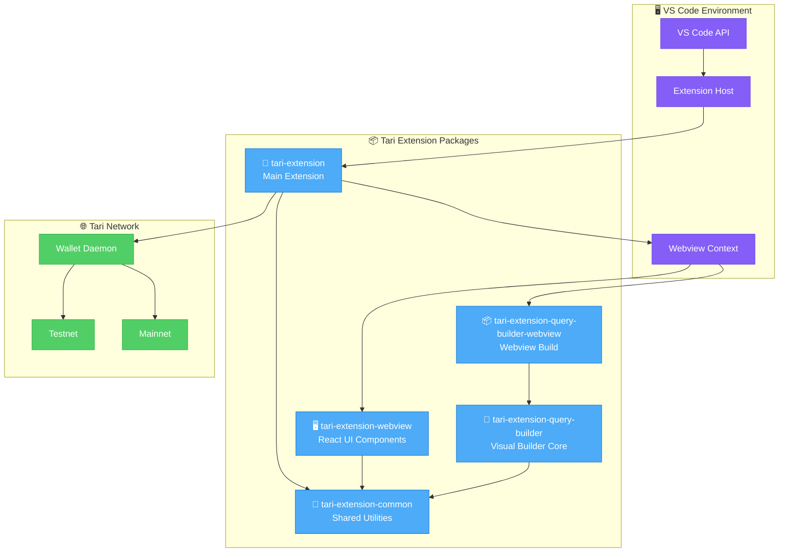
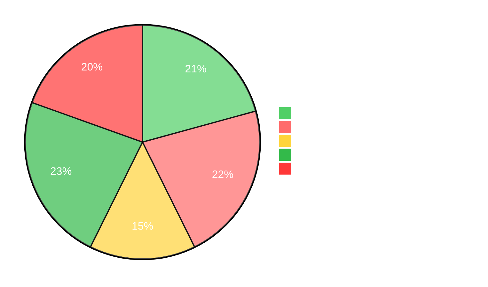

# Tari VS Code Extension

> **✨ Visual blockchain development for the Tari ecosystem**

Transform your Tari development experience with a powerful VS Code extension that brings visual transaction building and seamless blockchain integration directly to your IDE.

## 🚀 What You'll Get

- **🎨 Visual Transaction Builder**: Drag-and-drop interface for creating complex Tari transactions
- **📝 Custom .tari File Support**: Dedicated visual flow editor 
- **⚡ Live Preview**: Real-time visualization of your transaction flows
- **🛡️ Built-in Validation**: Catch errors before deployment with cycle detection and parameter validation
- **🌐 Tari Network Integration**: Direct connection to Tari wallets and network nodes

## 📋 Quick Start

### Prerequisites

- **VS Code** 1.74.0 or higher
- **Node.js** 18+ (managed automatically via proto)
- **pnpm** 8+ (managed automatically via proto)

### Installation

1. **Install tool manager**:
   ```bash
   # Install proto for automatic tool version management
   curl -fsSL https://moonrepo.dev/install/proto.sh | bash
   ```

2. **Clone and setup**:
   ```bash
   git clone https://github.com/tari-project/tari-vscode-nocode-extension.git
   cd tari-vscode-nocode-extension
   
   # Install correct tool versions and dependencies
   proto use
   pnpm install
   ```

3. **Build the extension**:
   ```bash
   moon tari-extension:build
   ```

4. **Run locally**:
   ```bash
   cd packages/tari-extension
   code .
   ```
   
   Then press `F5` or go to "Run and Debug" → "Run Extension"

## 🏗️ Architecture

This is a **monorepo** containing multiple interconnected packages with a sophisticated communication architecture:



**Package Responsibilities:**
- **🎯 tari-extension**: Core VS Code integration, custom editors, and command handling
- **🔧 tari-extension-common**: Type-safe message passing, configuration utilities, and shared types
- **🖥️ tari-extension-webview**: Activity bar React components and JSON parsing
- **🎨 tari-extension-query-builder**: Visual transaction building logic and execution planning
- **📦 tari-extension-query-builder-webview**: Webview-optimized build for `.tari` file editor

## 🎯 Key Features

### Visual Transaction Building
Create complex Tari transactions using an intuitive drag-and-drop interface powered by ReactFlow:

```mermaid
flowchart LR
    subgraph "🎨 Visual Editor"
        A[Input Node<br/>💰 Amount: 1000]
        B[Call Node<br/>🔄 transfer_tokens]
        C[Log Node<br/>📝 Transfer Complete]
    end
    
    A -->|amount| B
    B -->|result| C
    
    classDef input fill:#e3f2fd,stroke:#1976d2,color:#000
    classDef call fill:#f3e5f5,stroke:#7b1fa2,color:#000
    classDef log fill:#e8f5e8,stroke:#388e3c,color:#000
    
    class A input
    class B call
    class C log
```

**Features:**
- **🧩 Smart Node System**: Pre-built nodes for common Tari operations (add input parameters, emit log, allocate address)
- **🔗 Intelligent Connection**: Automatic parameter validation and type checking with real-time feedback
- **📊 Execution Planning**: Optimal transaction ordering with cycle detection and dependency resolution
- **⚡ Real-time Preview**: Live TypeScript and JavaScript generation and validation as you build your transaction flow

### Custom .tari File Editor
Dedicated file format for storing and sharing transaction flows:

- **JSON-based Storage**: Human-readable transaction definitions
- **VS Code Integration**: Full IDE support with IntelliSense
- **Version Control Friendly**: Diff-able transaction definitions
- **Team Collaboration**: Share transaction templates across teams

### Tari Network Integration
Seamless connection to the Tari ecosystem:

- **Wallet Integration**: Direct wallet daemon connectivity
- **Network Configuration**: Support for testnet and mainnet
- **Transaction Execution**: One-click deployment of visual transactions
- **Real-time Feedback**: Live status updates during execution

## 📚 Documentation Hub

**🎯 Getting Started**
- **[📖 User Guide](docs/GETTING_STARTED.md)** - Complete walkthrough from installation to first transaction
- **[⚡ Quick Start](#-quick-start)** - Get up and running in 5 minutes

**🔧 For Developers**  
- **[🏗️ Developer Guide](docs/DEVELOPER_GUIDE.md)** - Architecture, development workflow, and contribution guide
- **[📋 API Reference](docs/API_REFERENCE.md)** - Complete API documentation with verified examples from test files
- **[🤝 Contributing](CONTRIBUTING.md)** - Development setup, code standards, and submission process

**📦 Package Documentation**
- **[🎯 Core Extension](packages/tari-extension/README.md)** - VS Code integration and custom editors
- **[🎨 Query Builder](packages/tari-extension-query-builder/README.md)** - Visual transaction building engine  
- **[🖥️ Webview Components](packages/tari-extension-webview/README.md)** - React UI and JSON parsing

**🚀 Project Resources**
- **[📝 Changelog](CHANGELOG.md)** - Release notes and version history
- **[🏗️ Architecture Overview](#-architecture)** - System design and package relationships

## 🚦 Development Status



**Status Overview:**
- ✅ **Core Extension**: Fully functional VS Code integration with custom editors and commands
- ✅ **Visual Builder**: Complete drag-and-drop transaction creation with ReactFlow
- ✅ **JSON Parser**: Intelligent Tari data structure handling and outline generation
- ✅ **Execution Planning**: Smart transaction ordering with cycle detection and validation
- ✅ **Documentation**: Comprehensive, verified documentation with visual diagrams
- ⚠️ **Network Integration**: In development - wallet connectivity and testnet integration
- 📋 **Marketplace Publishing**: Planned for stable release after network integration completion

## 🛠️ Quick Development Commands

```bash
# 🏗️ Build everything
moon tari-extension:build

# 🧪 Run tests
moon :test

# 🎨 Verify code formatting
moon :format

# 🔍 Lint code
moon :lint

# 📦 Build specific package
cd packages/tari-extension-query-builder
pnpm build
```

## 🤝 Contributing

We welcome contributions! See our [Contributing Guide](CONTRIBUTING.md) for details on:

- 🏗️ **Development Setup**: Getting your environment ready
- 📝 **Code Style**: Formatting and linting requirements  
- 🧪 **Testing**: Writing and running tests
- 📋 **Pull Requests**: Submission process and requirements

## 📄 License

Licensed under the **BSD 3-Clause License** - see [LICENSE](LICENSE) for details.

## 🌟 Built With

- **[VS Code Extension API](https://code.visualstudio.com/api)** - Core extension platform
- **[ReactFlow](https://reactflow.dev/)** - Visual graph editing
- **[React](https://react.dev/)** - Modern UI framework
- **[TypeScript](https://www.typescriptlang.org/)** - Type-safe development
- **[Moon](https://moonrepo.dev/)** - Monorepo build orchestration
- **[pnpm](https://pnpm.io/)** - Fast, disk space efficient package manager

---

**Ready to revolutionize your Tari development experience?** [Get started with the user guide](docs/GETTING_STARTED.md) or dive into the [developer documentation](docs/DEVELOPER_GUIDE.md).
