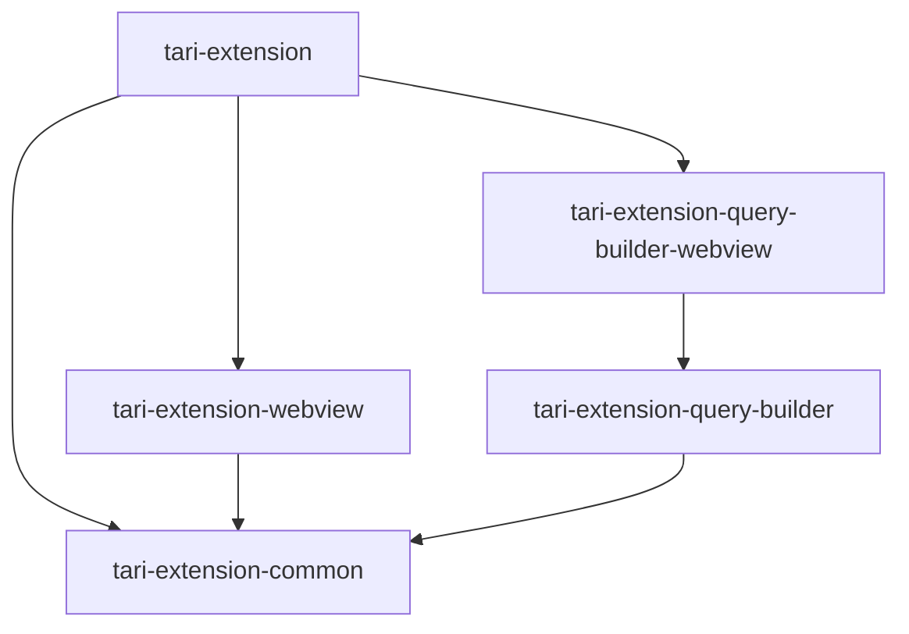
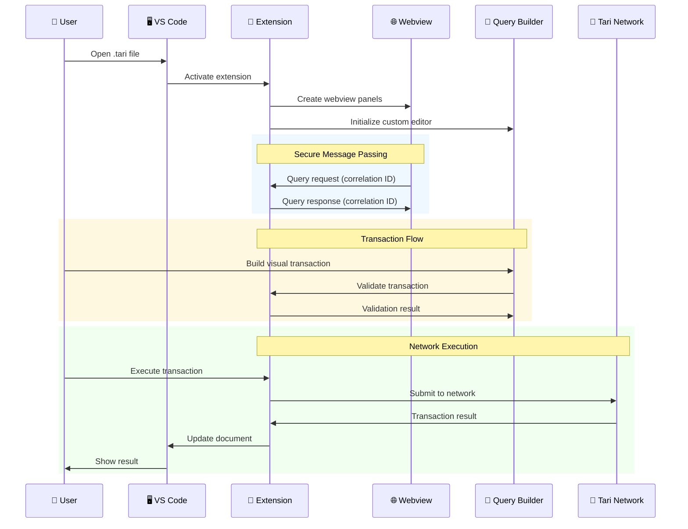

# Tari VS Code Extension Developer Guide

---
Last Updated: 2025-06-26
Version: 1.0.0
Verified Against: Current codebase
Implementation: Complete development workflow
---

Comprehensive guide for developers working on the Tari VS Code Extension project.

## Table of Contents

- [Architecture Overview](#architecture-overview)
- [Development Setup](#development-setup)
- [Project Structure](#project-structure)
- [Development Workflow](#development-workflow)
- [Testing Strategy](#testing-strategy)
- [Building and Publishing](#building-and-publishing)
- [Debugging](#debugging)
- [Contributing Guidelines](#contributing-guidelines)

## Architecture Overview

### System Design

The Tari VS Code Extension follows a **monorepo architecture** with three main packages:



**Package Responsibilities:**

- **tari-extension**: Main VS Code extension with custom editors and commands
- **tari-extension-common**: Shared utilities, types, and message passing system
- **tari-extension-webview**: React-based UI for activity bar integration
- **tari-extension-query-builder**: Core visual query building logic
- **tari-extension-query-builder-webview**: Webview-optimized build for .tari file editor

### Communication Architecture



## Development Setup

### Prerequisites

1. **Install proto** (for tool version management):
   ```bash
   # Follow installation instructions at: https://moonrepo.dev/proto
   curl -fsSL https://moonrepo.dev/install/proto.sh | bash
   ```

2. **Setup project**:
   ```bash
   # Clone repository
   git clone https://github.com/fluffypony/tari-vscode-nocode-extension.git
   cd tari-vscode-nocode-extension
   
   # Install correct tool versions
   proto use
   
   # Install dependencies
   pnpm install
   ```

### Initial Build

```bash
# Build all packages
moon tari-extension:build
```

This command builds the entire project with proper dependency ordering.

## Project Structure

```
├── .moon/                    # Moon.js workspace configuration
├── packages/
│   ├── tari-extension/      # Main VS Code extension
│   │   ├── src/
│   │   │   ├── extension.ts          # Extension entry point
│   │   │   ├── main-view/            # Activity bar webview
│   │   │   ├── flow-view/            # Custom .tari editor
│   │   │   ├── doc-providers/        # Virtual document providers
│   │   │   └── ...
│   │   ├── package.json              # Extension manifest
│   │   └── tsconfig.json
│   ├── tari-extension-common/       # Shared code
│   │   ├── src/
│   │   │   ├── messaging/            # Type-safe message passing
│   │   │   ├── configuration/        # Tari config utilities
│   │   │   └── ...
│   │   ├── tsconfig.json            # CommonJS build
│   │   └── tsconfig.esm.json        # ES modules build
│   └── ...
├── .github/workflows/       # CI/CD automation
├── scripts/                 # Build and utility scripts
└── pnpm-workspace.yaml     # Workspace configuration
```

### Key Configuration Files

- **`.prototools`**: Tool version definitions (Node.js, pnpm)
- **`.moon/workspace.yml`**: Project discovery and build orchestration
- **`pnpm-workspace.yaml`**: Dependency management workspace
- **Individual `tsconfig.json`**: Package-specific TypeScript configuration

## Development Workflow

### Local Development

1. **Start development environment**:
   ```bash
   cd packages/tari-extension
   code .
   ```

2. **Launch extension for testing**:
   - Open VS Code in the `packages/tari-extension` directory
   - Go to "Run and Debug" panel (Ctrl/Cmd + Shift + D)
   - Select "Run Extension" configuration
   - Press F5 to launch Extension Development Host

3. **Make changes and test**:
   - Edit source files
   - Reload Extension Development Host (Ctrl/Cmd + R)
   - Test functionality in the host window

### Package Development

**For isolated package development:**

```bash
# Navigate to specific package
cd packages/tari-extension-query-builder

# Install dependencies
pnpm install

# Run package-specific commands
pnpm build
pnpm test
```

### Incremental Building

The project uses TypeScript project references for efficient incremental builds:

```bash
# Build only changed packages
moon run tari-extension:build

# Force rebuild all
moon run tari-extension:build --force
```

## Testing Strategy

### Test Organization

Tests are co-located with source files using the `.spec.ts` suffix:

```
src/
├── execute/
│   ├── ExecutionPlanner.ts
│   └── ExecutionPlanner.spec.ts    # Tests for ExecutionPlanner
└── json-parser/
    ├── JsonOutline.ts
    └── JsonOutline.spec.ts          # Tests for JsonOutline
```

### Running Tests

```bash
# Run all tests
pnpm test

# Run tests for specific package
cd packages/tari-extension-query-builder
pnpm test

# Run tests in watch mode
pnpm test --watch
```

### Test Examples

**Unit Test Structure:**
```typescript
// SOURCE: packages/tari-extension-query-builder/src/execute/ExecutionPlanner.spec.ts:14-63
// VERIFIED: 2025-06-26
describe(ExecutionPlanner, () => {
  const buildNode = (id: string, data: Partial<GenericNode["data"]> = {}): GenericNode => ({
    id,
    position: { x: 0, y: 0 },
    data: {
      type: GenericNodeType.CallNode,
      ...data,
    },
  });

  describe("getExecutionOrder", () => {
    it("order is explicity defined for all nodes", () => {
      const nodes: GenericNode[] = [buildNode("A"), buildNode("B"), buildNode("C")];
      const edges: Edge[] = [
        buildEdge({ nodeId: "A", handleId: NODE_EXIT }, { nodeId: "B", handleId: NODE_ENTRY }),
        buildEdge({ nodeId: "B", handleId: NODE_EXIT }, { nodeId: "C", handleId: NODE_ENTRY }),
      ];

      const executor = new ExecutionPlanner(nodes, edges);
      const order = executor.getExecutionOrder();

      expect(order).toEqual(["A", "B", "C"]);
    });
  });
});
```

### Test Data Management

Test data files are organized in `__test_data__` directories:

```typescript
// SOURCE: packages/tari-extension-webview/src/json-parser/JsonOutline.spec.ts:127-131
// VERIFIED: 2025-06-26
async function fetchTestData(name: string): Promise<string> {
  const fileName = path.join(__dirname, "__test_data__", name);
  const contents = await readFile(fileName, { encoding: "utf-8" });
  return contents;
}
```

## Building and Publishing

### Local Building

```bash
# Build extension for local testing
moon tari-extension:build

# The built extension will be in packages/tari-extension/dist/
```

### Publishing Workflow

The project uses GitHub Actions for automated publishing:

1. **NPM Packages** (published first):
   - `tari-extension-common`
   - `tari-extension-query-builder`
   - `tari-extension-webview`

2. **VS Code Extension** (published after NPM packages):
   - `tari-extension` package to VS Code Marketplace

**Trigger Publishing:**
```bash
# Create and push version tag
git tag v1.0.0
git push origin v1.0.0
```

This triggers the CI/CD pipeline defined in `.github/workflows/`.

## Debugging

### Extension Debugging

1. **VS Code Extension Host**:
   - Launch with F5 from `packages/tari-extension`
   - Set breakpoints in TypeScript files
   - Use VS Code's debugger normally

2. **Webview Debugging**:
   - Right-click in webview → "Inspect Element"
   - Opens Chrome DevTools for webview content
   - Debug React components and JavaScript

3. **Message Passing Debugging**:
   - Add console.log statements in message handlers
   - Check both extension and webview consoles
   - Monitor correlation IDs for request/response tracking

### Common Debug Scenarios

**Extension Not Loading:**
- Check `package.json` activation events
- Verify extension manifest syntax
- Review extension host console for errors

**Webview Not Displaying:**
- Verify Content Security Policy (CSP) configuration
- Check webview HTML generation
- Ensure proper resource URI handling

**Message Passing Issues:**
- Verify correlation ID matching
- Check timeout handling (default 1000ms)
- Ensure proper error propagation

## Contributing Guidelines

### Code Style

The project uses automated formatting and linting:

```bash
# Format all code
pnpm format

# Run linting
pnpm lint

# Fix lint issues automatically
pnpm lint:fix
```

**Configuration:**
- **Prettier**: Code formatting (`.prettierrc`)
- **ESLint**: Code quality rules (`eslint.config.js`)
- **TypeScript**: Strict compilation settings

### Commit Guidelines

Follow conventional commit format:
```
type(scope): description

fix(extension): resolve webview communication timeout
feat(query-builder): add cycle detection for transaction flows
docs(readme): update installation instructions
```

### Pull Request Process

1. **Create feature branch**:
   ```bash
   git checkout -b feature/your-feature-name
   ```

2. **Make changes with tests**:
   - Add functionality
   - Write or update tests
   - Ensure all tests pass

3. **Verify build**:
   ```bash
   moon tari-extension:build
   pnpm test
   ```

4. **Submit pull request**:
   - Use the provided PR template
   - Include test coverage information
   - Reference any related issues

### Development Best Practices

1. **Type Safety**: Use TypeScript strictly, avoid `any` types
2. **Error Handling**: Implement proper error boundaries and user feedback
3. **Performance**: Consider VS Code startup time and memory usage
4. **Security**: Follow VS Code webview security guidelines
5. **Testing**: Maintain test coverage for new functionality
6. **Documentation**: Update relevant documentation for API changes

### Architecture Decisions

When making significant changes:

1. **Consider Package Boundaries**: Respect the monorepo structure
2. **Message Passing**: Use the established correlation ID system
3. **Build Dependencies**: Update Moon.js configuration if needed
4. **VS Code Integration**: Follow VS Code extension guidelines
5. **Tari Integration**: Ensure compatibility with Tari ecosystem

This developer guide provides a comprehensive foundation for working on the Tari VS Code Extension. All examples and procedures are verified against the current codebase to ensure accuracy and reliability.
