# Getting Started with Tari VS Code Extension

---
Last Updated: 2025-06-26
Version: 1.0.0
Audience: End users and developers new to Tari
Verified Against: Current codebase implementation
---

> **✨ Your first steps into visual blockchain development with Tari**

Welcome to the Tari VS Code Extension! This guide will walk you through everything you need to know to start building beautiful, visual blockchain transactions in minutes.

## 🎯 What You'll Learn

By the end of this guide, you'll be able to:
- Install and configure the Tari VS Code Extension
- Create your first `.tari` transaction file
- Build a simple transaction using the visual editor
- Validate and understand transaction flows
- Connect to a Tari network (testnet)

## 📋 Prerequisites

### Required Software

- **VS Code** 1.74.0 or higher ([Download here](https://code.visualstudio.com/))
- **Node.js** 18+ (will be installed automatically via proto)
- **Basic familiarity** with VS Code (opening files, using extensions)

### Optional (For Advanced Features)

- **Tari Wallet** daemon running locally
- **Basic blockchain knowledge** (helpful but not required)

## 🚀 Installation

### Option 1: From VS Code Marketplace (Recommended)

1. **Open VS Code**
2. **Go to Extensions** (Ctrl+Shift+X or Cmd+Shift+X)
3. **Search for "Tari"**
4. **Click "Install"** on the Tari VS Code Extension
5. **Reload VS Code** when prompted

### Option 2: Manual Installation (Development)

For developers or those wanting the latest features:

1. **Install proto** (tool version manager):
   ```bash
   curl -fsSL https://moonrepo.dev/install/proto.sh | bash
   ```

2. **Clone and build**:
   ```bash
   git clone https://github.com/fluffypony/tari-vscode-nocode-extension.git
   cd tari-vscode-nocode-extension
   proto use
   pnpm install
   moon tari-extension:build
   ```

3. **Install in VS Code**:
   ```bash
   cd packages/tari-extension
   code --install-extension $(ls *.vsix | head -1)
   ```

## 🎨 Your First Transaction

### Step 1: Create a New Transaction File

1. **Open VS Code**
2. **Create a new file**: `File` → `New File`
3. **Save it with .tari extension**: `my-first-transaction.tari`
4. **Watch it open** in the Tari Flow Editor automatically

### Step 2: Understanding the Interface

When you open a `.tari` file, you'll see the Tari Flow Editor with an intuitive layout:

```mermaid
graph TB
    subgraph "🎨 Tari Flow Editor Interface"
        subgraph "📋 Node Palette"
            A[🔲 Call Node<br/>Function calls]
            B[📥 Input Node<br/>Parameters]
            C[📤 Output Node<br/>Results]
            D[📊 Log Node<br/>Debug output]
            E[⚡ Action Node<br/>Operations]
        end
        
        subgraph "🎯 Canvas Area"
            F[Start Node] --> G[Your Transaction Flow] --> H[End Node]
        end
        
        subgraph "⚙️ Properties Panel"
            I[Selected Node Configuration]
            J[Parameter Settings]
            K[Validation Status]
        end
    end
    
    A -.->|Drag to Canvas| G
    B -.->|Drag to Canvas| G
    C -.->|Drag to Canvas| G
    D -.->|Drag to Canvas| G
    E -.->|Drag to Canvas| G
    
    G -.->|Select Node| I
    
    classDef palette fill:#e3f2fd,stroke:#1976d2,color:#000
    classDef canvas fill:#f3e5f5,stroke:#7b1fa2,color:#000
    classDef props fill:#e8f5e8,stroke:#388e3c,color:#000
    
    class A,B,C,D,E palette
    class F,G,H canvas
    class I,J,K props
```



**Key Areas:**
- **📋 Node Palette** (left): Available building blocks for your transaction
- **🎯 Canvas Area** (center): Where you build your transaction flow visually
- **⚙️ Properties Panel** (bottom): Configure selected node settings and view validation status

### Step 3: Build Your First Flow

Let's create a simple "Hello Tari" transaction with a step-by-step visual guide:

```mermaid
flowchart TD
    subgraph "🎯 Your First Transaction Flow"
        A[📥 Input Node<br/>message: "Hello Tari!"]
        B[🔲 Call Node<br/>emit_log]
        C[📊 Log Node<br/>Display Result]
    end
    
    A -->|message parameter| B
    B -->|log output| C
    
    classDef input fill:#e3f2fd,stroke:#1976d2,color:#000
    classDef call fill:#f3e5f5,stroke:#7b1fa2,color:#000
    classDef log fill:#e8f5e8,stroke:#388e3c,color:#000
    
    class A input
    class B call
    class C log
```

**Step-by-Step Instructions:**

1. **🚀 Add Input Node**:
   - Drag an Input Node from palette to canvas
   - Set **Type**: `String`, **Name**: `message`, **Value**: `"Hello Tari!"`

2. **🔲 Add Call Node**:
   - Drag a Call Node to the canvas
   - Set **Function**: `emit_log`
   - Connect the `message` output from Input Node to Call Node input

3. **📊 Add Log Node**:
   - Drag a Log Node to display the result
   - Connect Call Node output to Log Node input

4. **🔗 Verify Connections**:
   - All nodes should show green connection indicators
   - No red error markers should appear

### Step 4: Validate Your Transaction

1. **Open Command Palette** (Ctrl+Shift+P or Cmd+Shift+P)
2. **Type**: `Tari: Validate Transaction`
3. **Press Enter**
4. **Check for errors** in the Problems panel

✅ **Success**: Green checkmarks indicate your transaction is valid
❌ **Errors**: Red X marks show validation issues to fix

## 🔧 Configuration

### Basic Settings

Configure the extension through VS Code settings:

1. **Open Settings** (Ctrl+, or Cmd+,)
2. **Search for "tari"**
3. **Configure key settings**:

```json
{
  "tari.network": "testnet",
  "tari.enableAutoValidation": true,
  "tari.showGridInEditor": true,
  "tari.defaultTransactionFee": "100"
}
```

**Setting Explanations:**
- `network`: Choose between "testnet" and "mainnet"
- `enableAutoValidation`: Automatically check your transaction as you build
- `showGridInEditor`: Display helpful grid lines in the visual editor
- `defaultTransactionFee`: Default fee for new transactions

### Advanced Network Configuration

For connecting to a Tari wallet daemon:

```json
{
  "tari.walletDaemonAddress": "http://localhost:18143",
  "tari.network": "testnet",
  "tari.autoConnect": true
}
```

## 🎯 Building More Complex Transactions

### Using Parameters and Data Flow

**Example: Transfer with Custom Amount**

1. **Add an Input Parameter Node**:
   - Type: `Amount`
   - Name: `transfer_amount`
   - Default: `1000`

2. **Add a Call Node**:
   - Function: `transfer_tokens`
   - Connect `transfer_amount` to the amount parameter

3. **Add validation**:
   - Function: `assert_balance_sufficient`
   - Connect account and amount parameters

**Your flow:**
```
[Input: transfer_amount] 
        │
        ▼
[Call: assert_balance_sufficient] → [Call: transfer_tokens] → [Log: success]
        ▲
[Input: account_address]
```

### Working with Multiple Outputs

Some operations return multiple values. Handle them like this:

1. **Call Node with multiple returns**:
   - Function: `create_account_and_mint`
   - Returns: `account_id`, `resource_address`

2. **Connect different outputs**:
   - `account_id` → Next operation's account parameter
   - `resource_address` → Resource-related operations

## 🛠️ Common Commands

Access these through the Command Palette (Ctrl+Shift+P):

| Command | Description | When to Use |
|---------|-------------|-------------|
| `Tari: Create New Transaction` | Start a new .tari file | Beginning a new project |
| `Tari: Validate Transaction` | Check for errors | Before execution |
| `Tari: Execute Transaction` | Run on network | When ready to deploy |
| `Tari: Export to Code` | Generate executable code | For integration |
| `Tari: Configure Network` | Set up connections | Initial setup |

## 🔍 Understanding Validation

The extension provides real-time feedback on your transaction:

### ✅ Valid Transaction Indicators

- **Green connections**: Parameters properly linked
- **Green nodes**: All required inputs connected
- **No errors in Problems panel**: Transaction is executable

### ❌ Common Validation Issues

**Cycle Detected:**
```
❌ Error: Cycle detected in transaction flow
💡 Fix: Remove circular dependencies between nodes
```

**Missing Parameter:**
```
❌ Error: Required parameter 'amount' not connected
💡 Fix: Connect an input or previous node output
```

**Type Mismatch:**
```
❌ Error: Cannot connect String to Amount parameter
💡 Fix: Add a conversion node or change parameter type
```

## 🌐 Network Integration

### Connecting to Testnet

1. **Ensure Tari wallet daemon is running**:
   ```bash
   # Start testnet wallet daemon
   tari_wallet_daemon --network testnet
   ```

2. **Configure extension**:
   ```json
   {
     "tari.walletDaemonAddress": "http://localhost:18143",
     "tari.network": "testnet"
   }
   ```

3. **Test connection**:
   - Command Palette → `Tari: Configure Network`
   - Should show "Connected" status

### Executing Transactions

1. **Validate first**: Ensure no errors
2. **Execute**: Command Palette → `Tari: Execute Transaction`
3. **Monitor progress**: Watch status in VS Code's status bar
4. **View results**: Check Output panel for transaction hash

## 🎨 Visual Editor Tips

### Navigation
- **Pan**: Click and drag on empty canvas
- **Zoom**: Mouse wheel or Ctrl/Cmd + scroll
- **Select**: Click on nodes or connections
- **Multi-select**: Ctrl/Cmd + click

### Node Management
- **Add nodes**: Drag from palette
- **Delete**: Select and press Delete
- **Copy/Paste**: Ctrl/Cmd + C, Ctrl/Cmd + V
- **Undo/Redo**: Ctrl/Cmd + Z, Ctrl/Cmd + Y

### Connection Tips
- **Connect**: Drag from output handle to input handle
- **Disconnect**: Click connection and press Delete
- **Auto-layout**: Right-click → "Auto Layout"

## 🧪 Testing Your Transactions

### Local Testing

1. **Use testnet**: Always test on testnet first
2. **Small amounts**: Start with minimal transaction values
3. **Validate frequently**: Use auto-validation for immediate feedback

### Debugging Issues

**Transaction fails validation:**
1. Check the Problems panel for specific errors
2. Hover over red error indicators
3. Use `Tari: Export to Code` to see generated code

**Execution fails:**
1. Verify wallet daemon connection
2. Check account balance
3. Ensure network connectivity

## 📚 Example Transactions

### Example 1: Simple Token Transfer

**File**: `simple-transfer.tari`

**Flow**:
```
[Input: recipient_address] 
        │
        ▼
[Input: amount] → [Call: transfer_tokens] → [Log: "Transfer complete"]
        │               ▲
        └─→ [Input: sender_account]
```

### Example 2: Create and Fund Account

**File**: `create-account.tari`

**Flow**:
```
[Call: create_account] → [Call: fund_account] → [Log: account_details]
        │                        ▲
        └─→ account_id ──────────┘
```

### Example 3: Multi-Step Transaction

**File**: `complex-transaction.tari`

**Flow**:
```
[Call: create_resource] → [Call: mint_tokens] → [Call: distribute] → [Log: success]
        │                        │                      ▲
        └─→ resource_address ────┘                      │
                                                        │
[Input: recipients] ────────────────────────────────────┘
```

## 🆘 Troubleshooting

### Common Issues

**Extension not loading:**
- Check VS Code version (1.74.0+)
- Restart VS Code
- Check Output panel for errors

**Visual editor not appearing:**
- Ensure file has `.tari` extension
- Right-click file → "Open With" → "Tari Flow Editor"

**Validation errors:**
- Check all nodes have required connections
- Verify parameter types match
- Look for circular dependencies

**Connection issues:**
- Verify wallet daemon is running
- Check network configuration
- Test with `curl http://localhost:18143/status`

### Getting Help

- **GitHub Issues**: [Report bugs or request features](https://github.com/fluffypony/tari-vscode-nocode-extension/issues)
- **Documentation**: [Developer Guide](DEVELOPER_GUIDE.md) and [API Reference](API_REFERENCE.md)
- **Community**: Join Tari Discord for real-time help

## 🎉 Next Steps

Now that you've mastered the basics:

1. **Explore Advanced Features**:
   - [Developer Guide](DEVELOPER_GUIDE.md) for technical details
   - [API Reference](API_REFERENCE.md) for complete function listings

2. **Join the Community**:
   - Contribute to the project on [GitHub](https://github.com/fluffypony/tari-vscode-nocode-extension)
   - Share your transactions and get feedback

3. **Build Real Applications**:
   - Create reusable transaction templates
   - Integrate with existing Tari applications
   - Deploy to mainnet when ready

## 📄 Additional Resources

- **Tari Documentation**: Learn about the Tari protocol at the official GitHub repository
- **[VS Code Tips](https://code.visualstudio.com/docs/getstarted/tips-and-tricks)**: Master VS Code for development
- **[Contributing Guide](../CONTRIBUTING.md)**: Help improve the extension

---

**🎉 Congratulations!** You're now ready to build amazing Tari applications with visual transaction flows. The future of blockchain development is visual, intuitive, and accessible to everyone.

**Ready for more advanced topics?** Check out the [Developer Guide](DEVELOPER_GUIDE.md) for deeper technical insights and contribution opportunities.
