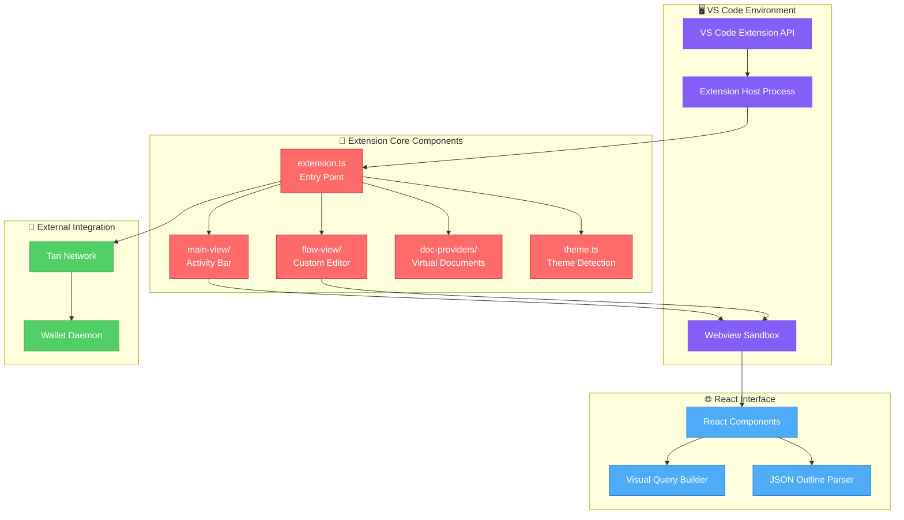

# Tari VS Code Extension

> **🎯 The core VS Code extension for visual Tari blockchain development**

This is the main extension package that provides VS Code integration for the Tari blockchain ecosystem. It delivers a comprehensive development environment with visual transaction building, intelligent code completion, and seamless network connectivity.

## ✨ Core Features

### 🎨 Visual Transaction Builder

Transform complex blockchain operations into intuitive drag-and-drop workflows:

- **Custom .tari File Editor**: Dedicated editor for transaction flow definitions
- **ReactFlow Integration**: Professional graph-based interface for building transactions
- **Real-time Validation**: Live error checking and cycle detection
- **Code Generation**: Automatic conversion from visual flows to executable code

### 🔧 Development Tools

- **Activity Bar Integration**: Dedicated Tari view in VS Code's activity bar
- **Command Palette**: Quick access to all Tari operations via `Ctrl+Shift+P`
- **IntelliSense Support**: Smart completion for Tari APIs and patterns
- **Syntax Highlighting**: Beautiful syntax coloring for `.tari` files

### ⚙️ Configuration & Connectivity

- **Wallet Integration**: Direct connection to Tari wallet daemon
- **Network Selection**: Switch between testnet and mainnet environments
- **Transaction Fees**: Configurable fee settings for optimal performance
- **Custom Endpoints**: Support for private Tari network connections

## 🏗️ Architecture

The extension follows VS Code's best practices with a clean separation of concerns:

```
Extension Core (packages/tari-extension/)
├── 🎯 extension.ts           # Extension activation & lifecycle
├── 📁 main-view/             # Activity bar webview provider
├── 📁 flow-view/             # Custom .tari file editor
├── 📁 doc-providers/         # Virtual document providers
├── 📁 format/                # Code formatting utilities
└── 📁 theme.ts               # Theme detection & synchronization
```

### 🔄 Communication Architecture



**Key Integration Points:**

- **🔧 Extension Host**: Runs in Node.js context with full VS Code API access and system integration
- **🌐 Webview Context**: Secure sandbox for React components with CSP-compliant message passing
- **📝 Custom Editor Provider**: Handles `.tari` file editing with full VS Code integration and real-time validation
- **📄 Document Providers**: Virtual documents for displaying generated code, JSON, and formatted output

## 🚀 Getting Started

### Installation from Marketplace

1. Open VS Code
2. Go to Extensions (Ctrl+Shift+X)
3. Search for "Tari VS Code Extension"
4. Click Install

### Manual execution (Development)

1. Clone the repository:

   ```bash
   git clone https://github.com/tari-project/tari-vscode-nocode-extension.git
   cd tari-vscode-nocode-extension
   ```

2. Install dependencies:

   ```bash
   proto use
   pnpm install
   ```

3. Build the extension:

   ```bash
   moon tari-extension:build
   ```

4. Launch extension:
   ```bash
   cd packages/tari-extension
   code .
   ```
   - Go to "Run and Debug" panel (Ctrl/Cmd + Shift + D)
   - Select "Run Extension" configuration
   - Press F5 to launch Extension Development Host

## 🎯 Usage Guide

### Creating Your First Transaction

1. **Create a new file**: `my-transaction.tari`
2. **Open the visual editor**: File opens automatically in Tari Flow Editor
3. **Build your transaction**: Drag nodes from the palette to create your flow
4. **Connect parameters**: Link node outputs to inputs
5. **Validate & execute**: Use the command palette to validate and run

### Working with .tari Files

**File Structure:**

```json
{
  "version": "1.0",
  "nodes": [
    {
      "id": "start",
      "type": "CallNode",
      "position": { "x": 100, "y": 100 },
      "data": {
        "type": "GenericNodeType.CallNode",
        "output": { "type": "String", "name": "result" }
      }
    }
  ],
  "edges": [
    {
      "id": "start-end",
      "source": "start",
      "target": "end",
      "sourceHandle": "exit",
      "targetHandle": "entry"
    }
  ]
}
```

### Available Commands

Access via Command Palette (`Ctrl+Shift+P`):

- `Tari: Create New Transaction` - Create a new .tari file
- `Tari: Validate Transaction` - Check current transaction for errors
- `Tari: Execute Transaction` - Run the transaction on the network
- `Tari: Export to Code` - Generate executable code from visual flow
- `Tari: Configure Network` - Set up wallet and network connections

## ⚙️ Configuration

Configure the extension via VS Code settings:

```json
{
  "tari.walletDaemonAddress": "http://localhost:18143",
  "tari.network": "testnet",
  "tari.defaultTransactionFee": "100",
  "tari.enableAutoValidation": true,
  "tari.showGridInEditor": true
}
```

**Configuration Options:**

- `walletDaemonAddress`: URL of your Tari wallet daemon
- `network`: Target network (testnet/mainnet)
- `defaultTransactionFee`: Default fee for transactions
- `enableAutoValidation`: Auto-validate transactions on save
- `showGridInEditor`: Display grid in visual editor

## 🧪 Testing & Development

### Local Development

1. **Open extension workspace**:

   ```bash
   cd packages/tari-extension
   code .
   ```

2. **Launch Extension Development Host**:

   - Press `F5` or go to Run and Debug
   - Select "Run Extension" configuration
   - New VS Code window opens with extension loaded

3. **Make changes and reload**:
   - Edit source files
   - Reload Extension Development Host (`Ctrl+R`)

### Testing Features

- **Create test .tari files** in the Extension Development Host
- **Test command palette** commands
- **Verify webview functionality** with React DevTools
- **Check message passing** between extension and webviews

## 🔌 Extension Points

The extension provides several integration points for other extensions:

### Commands

- `tari.createTransaction` - Programmatically create new transactions
- `tari.validateTransaction` - Validate transaction from other extensions
- `tari.executeTransaction` - Execute transactions programmatically

### Events

- `tari.onTransactionCreated` - Fired when new transaction is created
- `tari.onTransactionValidated` - Fired after validation completes
- `tari.onTransactionExecuted` - Fired after successful execution

## 🛠️ Dependencies

### Core Dependencies

- **vscode**: VS Code Extension API
- **tari-extension-common**: Shared utilities and types
- **tari-extension-query-builder-webview**: Visual editor components

### Development Dependencies

- **TypeScript**: Type-safe development
- **ESLint**: Code quality enforcement
- **Prettier**: Code formatting
- **@vscode/test-electron**: Extension testing framework

## 📋 Extension Manifest

Key extension configuration from `package.json`:

```json
{
  "contributes": {
    "customEditors": [
      {
        "viewType": "tari.flowEditor",
        "displayName": "Tari Flow Editor",
        "selector": [{ "filenamePattern": "*.tari" }]
      }
    ],
    "views": {
      "explorer": [
        {
          "id": "tariMainView",
          "name": "Tari",
          "when": "tari.enabled"
        }
      ]
    },
    "commands": [
      {
        "command": "tari.createTransaction",
        "title": "Create New Transaction",
        "category": "Tari"
      }
    ]
  }
}
```

## 🚀 Publishing

The extension is automatically published via GitHub Actions:

1. **Version bump**: Update version in `package.json`
2. **Create release**: Push git tag `v1.0.0`
3. **Automatic publishing**: GitHub Actions builds and publishes to marketplace

## 🤝 Contributing

This extension is part of a larger monorepo. See the [main project README](../../README.md) and [Developer Guide](../../docs/DEVELOPER_GUIDE.md) for comprehensive development instructions.

## 📄 License

Licensed under the BSD 3-Clause License - see [LICENSE](LICENSE) for details.

---

**Part of the Tari VS Code Extension ecosystem** - Revolutionizing blockchain development through visual tools and seamless VS Code integration.
